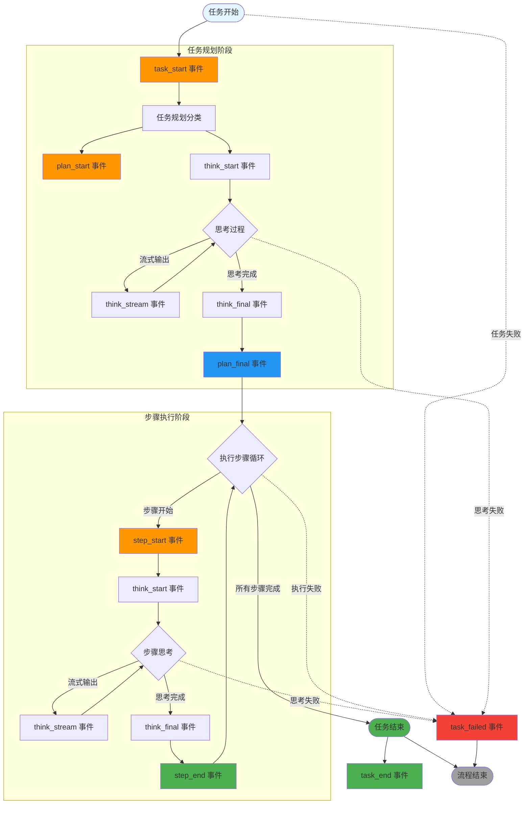

# 灵犀个人智能助手 API 接口设计文档

**文档版本**: V4.0  
**更新日期**: 2026-03-04  
**适用场景**: 个人本地运行的智能助手，支持桌面端客户端

---

## 📋 目录

- [1. 接口设计概览](#1-接口设计概览)
- [2. 会话管理API](#2-会话管理api)
- [3. 任务执行API](#3-任务执行api)
- [4. 断点管理API](#4-断点管理api)
- [5. 技能管理API](#5-技能管理api)
- [6. 资源监控API](#6-资源监控api)
- [7. 配置管理API](#7-配置管理api)
- [8. 统一响应格式](#8-统一响应格式)
- [9. 错误码定义](#9-错误码定义)
- [10. 流式响应事件定义](#10-流式响应事件定义)

---

## 1. 接口设计概览

### 1.1 API 路由总览

| 方法 | 路径 | 说明 | 认证 |
|------|------|------|------|
| POST | /api/sessions | 创建会话 | 否 |
| GET | /api/sessions | 获取会话列表 | 否 |
| GET | /api/sessions/{id} | 获取会话详情 | 否 |
| GET | /api/sessions/{id}/history | 获取会话历史 | 否 |
| DELETE | /api/sessions/{id} | 删除会话 | 否 |
| POST | /api/tasks/execute | 执行任务（异步） | 否 |
| POST | /api/tasks/stream | 执行任务（流式响应） | 否 |
| GET | /api/tasks/{id}/status | 获取任务状态 | 否 |
| POST | /api/tasks/{id}/retry | 重试任务 | 否 |
| POST | /api/tasks/{id}/cancel | 取消任务 | 否 |
| GET | /api/checkpoints | 获取断点列表 | 否 |
| POST | /api/checkpoints/{id}/resume | 恢复断点 | 否 |
| DELETE | /api/checkpoints/{id} | 删除断点 | 否 |
| GET | /api/skills | 获取技能列表 | 否 |
| POST | /api/skills/install | 安装技能 | 否 |
| GET | /api/skills/{id}/diagnose | 诊断技能 | 否 |
| POST | /api/skills/{id}/reload | 重新加载技能 | 否 |
| GET | /api/resources | 获取资源使用情况 | 否 |
| GET | /api/config | 获取配置 | 否 |
| PUT | /api/config | 更新配置 | 否 |

### 1.2 设计特点

- **统一响应格式**: 所有接口使用 `{code, message, data}` 统一结构
- **完整错误处理**: 流式接口包含详细的错误码和恢复建议
- **分页支持**: 列表接口支持分页、排序、筛选
- **实时反馈**: 流式接口提供细粒度的事件推送
- **心跳机制**: 防止长连接超时断开
- **灵活扩展**: 预留可选参数，支持未来扩展

---

## 2. 会话管理API

### 2.1 创建会话

```http
POST /api/sessions
Content-Type: application/json
```

**请求参数**:

| 参数名 | 类型 | 必填 | 说明 | 默认值 |
|-------|------|------|------|--------|
| user_name | string | 否 | 用户名 | "default" |
| title | string | 否 | 会话标题 | "新会话" |

**返回参数**:

```json
{
  "code": 200,
  "message": "success",
  "data": {
    "session_id": "uuid",
    "user_name": "string",
    "title": "string",
    "current_task_id": "uuid|null",
    "total_tokens": 0,
    "created_at": "2026-03-04T10:00:00Z",
    "updated_at": "2026-03-04T10:00:00Z"
  }
}
```

---

### 2.2 获取会话列表

```http
GET /api/sessions?page=1&page_size=20&user_name=default
```

**请求参数**:

| 参数名 | 类型 | 必填 | 说明 | 默认值 |
|-------|------|------|------|--------|
| page | integer | 否 | 页码 | 1 |
| page_size | integer | 否 | 每页数量 | 20 |
| user_name | string | 否 | 按用户名筛选 | - |
| sort_by | string | 否 | 排序字段（created_at/updated_at） | updated_at |
| order | string | 否 | 排序方向（asc/desc） | desc |

**返回参数**:

```json
{
  "code": 200,
  "message": "success",
  "data": {
    "total": 100,
    "page": 1,
    "page_size": 20,
    "sessions": [
      {
        "session_id": "uuid",
        "user_name": "string",
        "title": "string",
        "current_task_id": "uuid|null",
        "total_tokens": 12500,
        "created_at": "2026-03-04T10:00:00Z",
        "updated_at": "2026-03-04T10:05:00Z"
      }
    ]
  }
}
```

---

### 2.3 获取会话详情

```http
GET /api/sessions/{session_id}
```

**返回参数**:

```json
{
  "code": 200,
  "message": "success",
  "data": {
    "session_id": "uuid",
    "user_name": "string",
    "title": "string",
    "current_task_id": "uuid|null",
    "total_tokens": 12500,
    "created_at": "2026-03-04T10:00:00Z",
    "updated_at": "2026-03-04T10:05:00Z",
    "current_task": {
      "task_id": "uuid",
      "task_type": "simple|complex|trivial",
      "user_input": "string",
      "status": "running|completed|failed|paused",
      "current_step_idx": 2,
      "total_steps": 5,
      "created_at": "2026-03-04T10:00:00Z"
    }
  }
}
```

---

### 2.4 获取会话历史

```http
GET /api/sessions/{session_id}/history?max_turns=20&include_steps=true
```

**请求参数**:

| 参数名 | 类型 | 必填 | 说明 | 默认值 |
|-------|------|------|------|--------|
| max_turns | integer | 否 | 最大轮次 | 20 |
| include_steps | boolean | 否 | 是否包含步骤详情 | false |
| task_status | string | 否 | 按任务状态筛选（running/completed/failed） | - |

**返回参数**:

```json
{
  "code": 200,
  "message": "success",
  "data": {
    "session_id": "uuid",
    "total_turns": 15,
    "history": [
      {
        "task_id": "uuid",
        "role": "user|assistant",
        "content": "string",
        "task_type": "simple|complex|trivial",
        "status": "completed",
        "timestamp": 1708764000.0,
        "steps": [
          {
            "step_id": "uuid",
            "step_index": 0,
            "step_type": "thinking|action",
            "description": "string",
            "thought": "string",
            "result": "string",
            "skill_call": "string|null",
            "status": "completed",
            "created_at": "2026-03-04T10:00:01Z"
          }
        ]
      }
    ]
  }
}
```

---

### 2.5 删除会话

```http
DELETE /api/sessions/{session_id}
```

**返回参数**:

```json
{
  "code": 200,
  "message": "success",
  "data": {
    "success": true,
    "deleted_tasks_count": 5,
    "deleted_steps_count": 23
  }
}
```

---

## 3. 任务执行API

### 3.1 执行任务（异步）

```http
POST /api/tasks/execute
Content-Type: application/json
```

**请求参数**:

| 参数名 | 类型 | 必填 | 说明 | 默认值 |
|-------|------|------|------|--------|
| task | string | 是 | 用户任务描述 | - |
| session_id | string | 是 | 会话ID | - |
| model_override | string\|null | 否 | 覆盖默认模型 | null |

**返回参数**:

```json
{
  "code": 200,
  "message": "success",
  "data": {
    "execution_id": "uuid",
    "task": "string",
    "task_level": "trivial|simple|complex",
    "model": "string",
    "status": "running|queued|completed|failed",
    "estimated_duration": 30,
    "created_at": 1708764000.0
  }
}
```

---

### 3.2 执行任务（流式响应）⭐

```http
POST /api/tasks/stream
Content-Type: application/json
```

**请求参数**:

| 参数名 | 类型 | 必填 | 说明 | 默认值 |
|-------|------|------|------|--------|
| task | string | 是 | 用户任务描述 | - |
| session_id | string | 是 | 会话ID | - |
| model_override | string\|null | 否 | 覆盖默认模型 | null |
| enable_heartbeat | boolean | 否 | 是否启用心跳 | true |
| heartbeat_interval | integer | 否 | 心跳间隔（秒） | 30 |

**返回参数（Server-Sent Events流）**:

```
data: {"event_type": "task_start", "data": {"execution_id": "uuid", "task": "查北京天气", "task_level": "simple", "model": "qwen-plus"}}

data: {"event_type": "plan_start", "data": {"execution_id": "uuid", "task_id": "uuid"}}

data: {"event_type": "think_start", "data": {"execution_id": "uuid", "task_id": "uuid", "step_id": "uuid", "content": "正在分析任务..."}}

data: {"event_type": "think_stream", "data": {"execution_id": "uuid", "task_id": "uuid", "step_id": "uuid", "content": "用户"}}

data: {"event_type": "think_stream", "data": {"execution_id": "uuid", "task_id": "uuid", "step_id": "uuid", "content": "请求"}}

data: {"event_type": "think_stream", "data": {"execution_id": "uuid", "task_id": "uuid", "step_id": "uuid", "content": "查询天气..."}}

data: {"event_type": "think_final", "data": {"execution_id": "uuid", "task_id": "uuid", "step_id": "uuid", "thought": "用户请求查询天气，这是一个简单任务"}}

data: {"event_type": "plan_final", "data": {"execution_id": "uuid", "task_id": "uuid", "plan": [{"description": "调用天气查询技能"}]}}

data: {"event_type": "step_start", "data": {"execution_id": "uuid", "task_id": "uuid", "step_id": "uuid", "step_index": 1, "description": "调用天气查询技能"}}

data: {"event_type": "step_end", "data": {"execution_id": "uuid", "task_id": "uuid", "step_id": "uuid", "step_index": 1, "result": {"temperature": 15, "condition": "晴"}, "status": "success"}}

data: {"event_type": "task_end", "data": {"execution_id": "uuid", "task_id": "uuid", "result": {"content": "北京今天天气晴朗，温度15°C"}, "status": "completed"}}

: heartbeat

data: {"event_type": "stream_end", "data": {}}
```

**客户端实现示例（JavaScript）**:

```javascript
const response = await fetch('/api/tasks/stream', {
  method: 'POST',
  headers: {'Content-Type': 'application/json'},
  body: JSON.stringify({
    task: '查北京天气',
    session_id: 'uuid',
    enable_heartbeat: true,
    heartbeat_interval: 30
  })
});

const reader = response.body.getReader();
const decoder = new TextDecoder();

while (true) {
  const {done, value} = await reader.read();
  if (done) break;
  
  const chunk = decoder.decode(value);
  const lines = chunk.split('\n');
  
  for (const line of lines) {
    if (line.startsWith('data: ')) {
      const event = JSON.parse(line.slice(6));
      console.log(event.event_type, event.data);
      
      if (event.event_type === 'task_failed') {
        handleError(event.data);
        return;
      }
      
      handleEvent(event);
    }
  }
}

function handleError(errorData) {
  switch (errorData.error_code) {
    case 'LLM_RATE_LIMIT':
      showError('API 调用过于频繁，请稍后重试');
      break;
    case 'LLM_TIMEOUT':
      showError('AI 响应超时，请检查网络或更换模型');
      break;
    case 'DATABASE_LOCKED':
      showError('系统繁忙，请稍后重试');
      break;
    default:
      showError(`执行失败：${errorData.error}`);
  }
  
  if (errorData.recoverable) {
    showRetryButton();
  }
}
```

---

### 3.3 获取任务状态

```http
GET /api/tasks/{task_id}/status
```

**返回参数**:

```json
{
  "code": 200,
  "message": "success",
  "data": {
    "execution_id": "uuid",
    "task": "string",
    "task_level": "trivial|simple|complex",
    "model": "string",
    "status": "running|completed|failed|paused|cancelled",
    "current_step": 3,
    "total_steps": 5,
    "progress": 60.0,
    "result": {
      "content": "string",
      "thought_chain": [],
      "steps": []
    },
    "error": {
      "error": "string",
      "error_code": "string",
      "traceback": "string"
    },
    "input_tokens": 1500,
    "output_tokens": 800,
    "created_at": 1708764000.0,
    "updated_at": 1708764010.0
  }
}
```

---

### 3.4 重试任务

```http
POST /api/tasks/{task_id}/retry
Content-Type: application/json
```

**请求参数**:

| 参数名 | 类型 | 必填 | 说明 | 默认值 |
|-------|------|------|------|--------|
| step_index | integer | 否 | 从指定步骤重试 | 失败步骤 |
| user_input | string\|null | 否 | 提供新的用户输入 | null |

**返回参数**:

```json
{
  "code": 200,
  "message": "success",
  "data": {
    "success": true,
    "message": "重试已开始",
    "execution_id": "uuid",
    "retry_from_step": 2
  }
}
```

---

### 3.5 取消任务

```http
POST /api/tasks/{task_id}/cancel
```

**返回参数**:

```json
{
  "code": 200,
  "message": "success",
  "data": {
    "success": true,
    "message": "任务已取消",
    "cancelled_at": 1708764010.0
  }
}
```

---

## 4. 断点管理API

### 4.1 获取断点列表

```http
GET /api/checkpoints?status=paused&page=1&page_size=20
```

**请求参数**:

| 参数名 | 类型 | 必填 | 说明 | 默认值 |
|-------|------|------|------|--------|
| status | string | 否 | 按状态筛选（paused/running/completed） | - |
| page | integer | 否 | 页码 | 1 |
| page_size | integer | 否 | 每页数量 | 20 |

**返回参数**:

```json
{
  "code": 200,
  "message": "success",
  "data": {
    "total": 10,
    "checkpoints": [
      {
        "session_id": "uuid",
        "task_id": "uuid",
        "task": "string",
        "task_level": "simple|complex",
        "current_step": 2,
        "total_steps": 5,
        "execution_status": "paused|running",
        "paused_reason": "user_request|error|timeout",
        "created_at": "2026-03-04T10:00:00Z",
        "updated_at": "2026-03-04T10:05:00Z"
      }
    ]
  }
}
```

---

### 4.2 恢复断点

```http
POST /api/checkpoints/{task_id}/resume
```

**返回参数**:

```json
{
  "code": 200,
  "message": "success",
  "data": {
    "execution_id": "uuid",
    "task": "string",
    "status": "running",
    "message": "断点已恢复",
    "resumed_from_step": 2
  }
}
```

---

### 4.3 删除断点

```http
DELETE /api/checkpoints/{task_id}
```

**返回参数**:

```json
{
  "code": 200,
  "message": "success",
  "data": {
    "success": true,
    "deleted_steps_count": 3
  }
}
```

---

## 5. 技能管理API

### 5.1 获取技能列表

```http
GET /api/skills?status=available&page=1&page_size=20
```

**请求参数**:

| 参数名 | 类型 | 必填 | 说明 | 默认值 |
|-------|------|------|------|--------|
| status | string | 否 | 按状态筛选（available/error/installed） | - |
| page | integer | 否 | 页码 | 1 |
| page_size | integer | 否 | 每页数量 | 20 |
| keyword | string | 否 | 按关键词搜索 | - |

**返回参数**:

```json
{
  "code": 200,
  "message": "success",
  "data": {
    "total": 15,
    "skills": [
      {
        "skill_id": "weather",
        "name": "天气查询",
        "description": "查询指定城市的天气信息",
        "version": "1.0.0",
        "author": "string",
        "status": "available|error|installed",
        "manifest": {},
        "installed_at": "2026-03-04T10:00:00Z"
      }
    ]
  }
}
```

---

### 5.2 安装技能

```http
POST /api/skills/install
Content-Type: application/json
```

**请求参数**:

| 参数名 | 类型 | 必填 | 说明 | 默认值 |
|-------|------|------|------|--------|
| skill_data | object | 是 | 技能元数据 | - |
| skill_data.name | string | 是 | 技能名称 | - |
| skill_data.version | string | 是 | 技能版本 | - |
| skill_data.description | string | 是 | 技能描述 | - |
| skill_data.author | string | 是 | 作者 | - |
| skill_data.dependencies | array | 否 | 依赖列表 | [] |
| skill_data.entry_point | string | 是 | 入口文件 | - |
| skill_files | object | 是 | 技能文件（Base64编码） | - |
| auto_fix | boolean | 否 | 是否自动修复依赖 | true |

**返回参数**:

```json
{
  "code": 200,
  "message": "success",
  "data": {
    "skill_id": "string",
    "status": "installed",
    "message": "技能安装成功",
    "installed_at": "2026-03-04T10:00:00Z"
  }
}
```

---

### 5.3 诊断技能

```http
GET /api/skills/{skill_id}/diagnose
```

**返回参数**:

```json
{
  "code": 200,
  "message": "success",
  "data": {
    "skill_id": "weather",
    "status": "error|healthy",
    "diagnostic_result": {
      "error_type": "missing_dependency|invalid_manifest|runtime_error",
      "error_message": "缺少依赖 requests",
      "fix_suggestion": "pip install requests",
      "can_auto_fix": true,
      "dependencies": [
        {
          "name": "requests",
          "required": "2.28.0",
          "installed": false
        }
      ]
    }
  }
}
```

---

### 5.4 重新加载技能

```http
POST /api/skills/{skill_id}/reload
```

**返回参数**:

```json
{
  "code": 200,
  "message": "success",
  "data": {
    "success": true,
    "message": "技能已重新加载",
    "reloaded_at": "2026-03-04T10:00:00Z"
  }
}
```

---

## 6. 资源监控API

### 6.1 获取资源使用情况

```http
GET /api/resources
```

**返回参数**:

```json
{
  "code": 200,
  "message": "success",
  "data": {
    "system": {
      "cpu_percent": 45.2,
      "memory_percent": 62.8,
      "disk_percent": 35.1
    },
    "token_usage": {
      "current": 12500,
      "limit": 100000,
      "percent": 12.5,
      "daily_limit": 10000,
      "daily_used": 2500
    },
    "tasks": {
      "running": 3,
      "queued": 5,
      "completed_today": 45
    },
    "skills": {
      "total": 15,
      "available": 12,
      "error": 3
    }
  }
}
```

---

## 7. 配置管理API

### 7.1 获取配置

```http
GET /api/config
```

**返回参数**:

```json
{
  "code": 200,
  "message": "success",
  "data": {
    "llm": {
      "model": "qwen-plus",
      "api_key": "sk-***",
      "base_url": "https://dashscope.aliyuncs.com/compatible-mode/v1",
      "timeout": 30,
      "max_retries": 3
    },
    "execution": {
      "max_steps": 10,
      "max_replan_count": 3,
      "enable_streaming": true
    },
    "storage": {
      "db_path": "./data/lingxi.db",
      "enable_checkpoint": true
    },
    "logging": {
      "level": "INFO",
      "log_file": "./logs/lingxi.log"
    }
  }
}
```

---

### 7.2 更新配置

```http
PUT /api/config
Content-Type: application/json
```

**请求参数**:

```json
{
  "llm": {
    "model": "string",
    "api_key": "string",
    "base_url": "string",
    "timeout": 30,
    "max_retries": 3
  },
  "execution": {
    "max_steps": 10,
    "max_replan_count": 3,
    "enable_streaming": true
  }
}
```

**返回参数**:

```json
{
  "code": 200,
  "message": "success",
  "data": {
    "success": true,
    "message": "配置已更新",
    "updated_at": "2026-03-04T10:00:00Z"
  }
}
```

---

## 8. 统一响应格式

### 8.1 成功响应

```json
{
  "code": 200,
  "message": "success",
  "data": {}
}
```

### 8.2 错误响应

```json
{
  "code": 400,
  "message": "error message",
  "data": null,
  "error": {
    "error_code": "INVALID_PARAMETER",
    "error_detail": "详细错误信息"
  }
}
```

### 8.3 HTTP 状态码

| 状态码 | 说明 |
|-------|------|
| 200 | 成功 |
| 400 | 请求参数错误 |
| 404 | 资源不存在 |
| 500 | 服务器内部错误 |

---

## 9. 错误码定义

### 9.1 通用错误码

| 错误码 | 说明 | 可重试 |
|-------|------|--------|
| INVALID_PARAMETER | 请求参数错误 | false |
| RESOURCE_NOT_FOUND | 资源不存在 | false |
| INTERNAL_ERROR | 内部错误 | false |
| UNAUTHORIZED | 未授权 | false |

### 9.2 任务执行错误码

| 错误码 | 说明 | 可重试 |
|-------|------|--------|
| LLM_RATE_LIMIT | LLM API限流 | true |
| LLM_TIMEOUT | LLM API超时 | true |
| SKILL_EXECUTION | 技能执行失败 | false |
| DATABASE_LOCKED | 数据库繁忙 | true |
| TASK_CANCELLED | 任务已取消 | false |
| UNKNOWN | 未知错误 | false |

### 9.3 技能管理错误码

| 错误码 | 说明 | 可重试 |
|-------|------|--------|
| SKILL_NOT_FOUND | 技能不存在 | false |
| SKILL_ALREADY_INSTALLED | 技能已安装 | false |
| MISSING_DEPENDENCY | 缺少依赖 | true |
| INVALID_MANIFEST | 无效的清单文件 | false |

---

## 10. 流式响应事件定义

### 10.1 事件类型列表

| 事件类型 | 触发时机 | 数据结构 |
|---------|---------|---------|
| task_start | 任务开始 | {execution_id, task, task_level, model} |
| plan_start | 计划开始 | {execution_id, task_id} |
| think_start | 思考开始 | {execution_id, task_id, step_id, content} |
| think_stream | 思考流式输出 | {execution_id, task_id, step_id, content} |
| think_final | 思考完成 | {execution_id, task_id, step_id, thought} |
| plan_final | 计划完成 | {execution_id, task_id, plan} |
| step_start | 步骤开始 | {execution_id, task_id, step_id, step_index, description} |
| step_end | 步骤结束 | {execution_id, task_id, step_id, step_index, result, status} |
| task_end | 任务结束 | {execution_id, task_id, result, status} |
| task_failed | 任务失败 | {execution_id, task_id, error, error_code, traceback?, recoverable} |
| ping | 心跳事件 | {timestamp} |
| stream_end | 流结束 | {} |

### 10.2 事件流程图



### 10.3 事件触发说明

| 阶段 | 触发时机 | 事件类型 |
|-------|---------|---------|
| 任务开始 | 提交任务时立即触发 | `task_start` |
| 任务规划 | 开始规划任务时 | `plan_start` |
| 任务思考 | 规划过程中思考 | `think_start` → `think_stream`* → `think_final` |
| 计划完成 | 规划完成时 | `plan_final` |
| 步骤开始 | 开始执行步骤时 | `step_start` |
| 步骤思考 | 步骤执行中思考 | `think_start` → `think_stream`* → `think_final` |
| 步骤结束 | 步骤执行完成时 | `step_end` |
| 任务结束 | 所有步骤完成时 | `task_end` |
| 任务失败 | 任何阶段失败时 | `task_failed` |

**注**: `think_stream` 事件可能在思考过程中多次触发（流式输出）。

### 10.4 心跳机制

**问题**: 如果某一步骤耗时过长（如等待外部 API 响应），代理服务器或浏览器可能因超时而切断连接。

**解决方案**: 在 yield 之间插入心跳事件。

**心跳事件格式**:

```
# 方式 1: SSE Comment（推荐，客户端自动忽略）
: heartbeat

# 方式 2: Ping 事件（客户端需处理）
data: {"event_type": "ping", "data": {"timestamp": 1708764000.0}}
```

**客户端心跳处理**:

```typescript
function handleEvent(event: Event) {
  switch (event.event_type) {
    case 'ping':
      updateConnectionStatus('connected');
      return;
      
    case 'stream_end':
      cleanup();
      return;
      
    default:
      processBusinessEvent(event);
  }
}
```

---

## 附录

### A. 数据类型说明

| 类型 | 说明 | 示例 |
|------|------|------|
| string | 字符串 | "hello" |
| integer | 整数 | 123 |
| float | 浮点数 | 123.45 |
| boolean | 布尔值 | true/false |
| array | 数组 | [1, 2, 3] |
| object | 对象 | {"key": "value"} |
| uuid | UUID字符串 | "550e8400-e29b-41d4-a716-446655440000" |
| timestamp | Unix时间戳（秒） | 1708764000.0 |
| datetime | ISO 8601格式时间 | "2026-03-04T10:00:00Z" |

### B. 枚举值说明

#### 任务级别 (task_level)
- `trivial`: 直接回答，无需工具
- `simple`: 单工具调用
- `complex`: 多工具调用，多步骤

#### 任务状态 (status)
- `running`: 运行中
- `queued`: 队列中
- `completed`: 已完成
- `failed`: 失败
- `paused`: 已暂停
- `cancelled`: 已取消

#### 步骤类型 (step_type)
- `thinking`: 思考步骤
- `action`: 执行步骤

#### 步骤状态 (status)
- `pending`: 待执行
- `running`: 执行中
- `completed`: 已完成
- `failed`: 失败

#### 技能状态 (status)
- `available`: 可用
- `installed`: 已安装
- `error`: 错误

### C. 实施检查清单

- ✅ 所有 `execute_stream` 方法必须包裹全局 try-except
- ✅ 捕获的异常必须转换为 `task_failed` 事件推送给前端
- ✅ 错误事件必须包含 `error_code` 便于客户端分类处理
- ✅ 长时间运行的步骤必须实现心跳机制
- ✅ 客户端必须处理 `task_failed` 事件并显示友好提示
- ✅ 所有接口使用统一的 `{code, message, data}` 响应格式
- ✅ 时间戳使用 ISO 8601 格式
- ✅ ID 使用 UUID 格式
- ✅ 敏感信息脱敏（如 api_key）

---

**文档结束**
