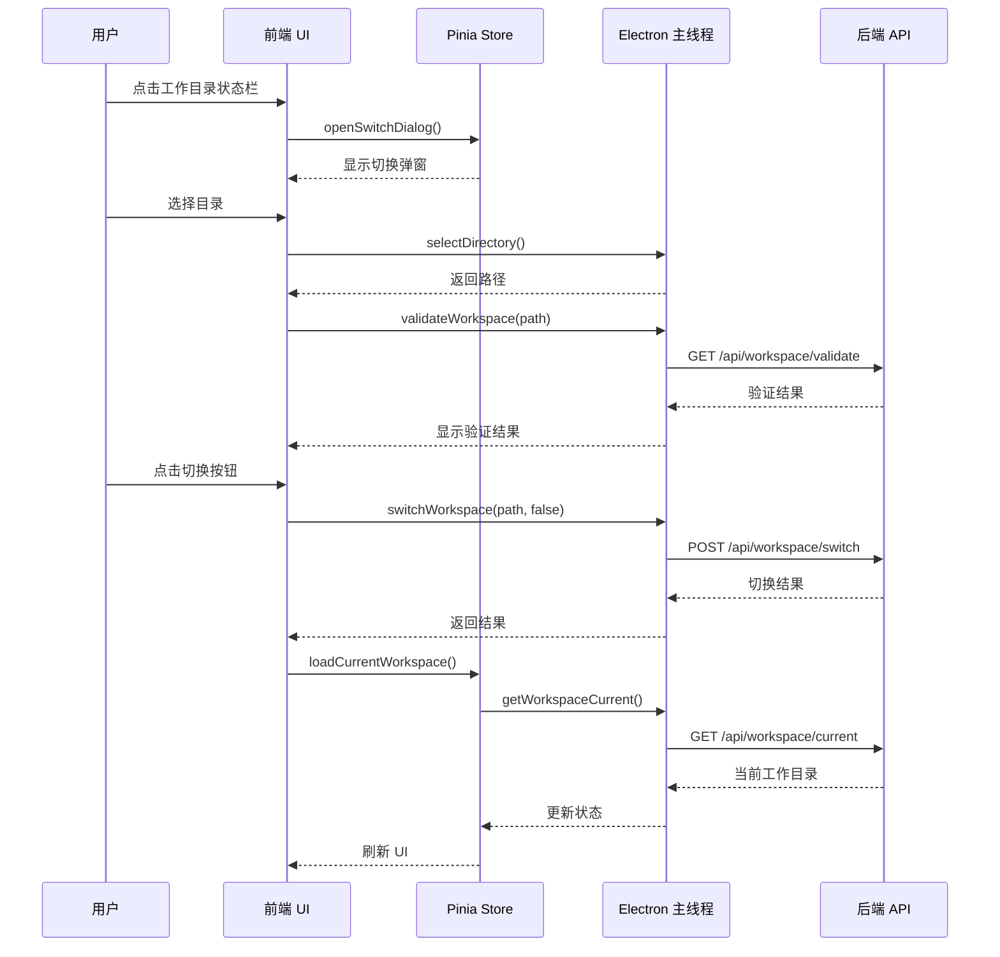
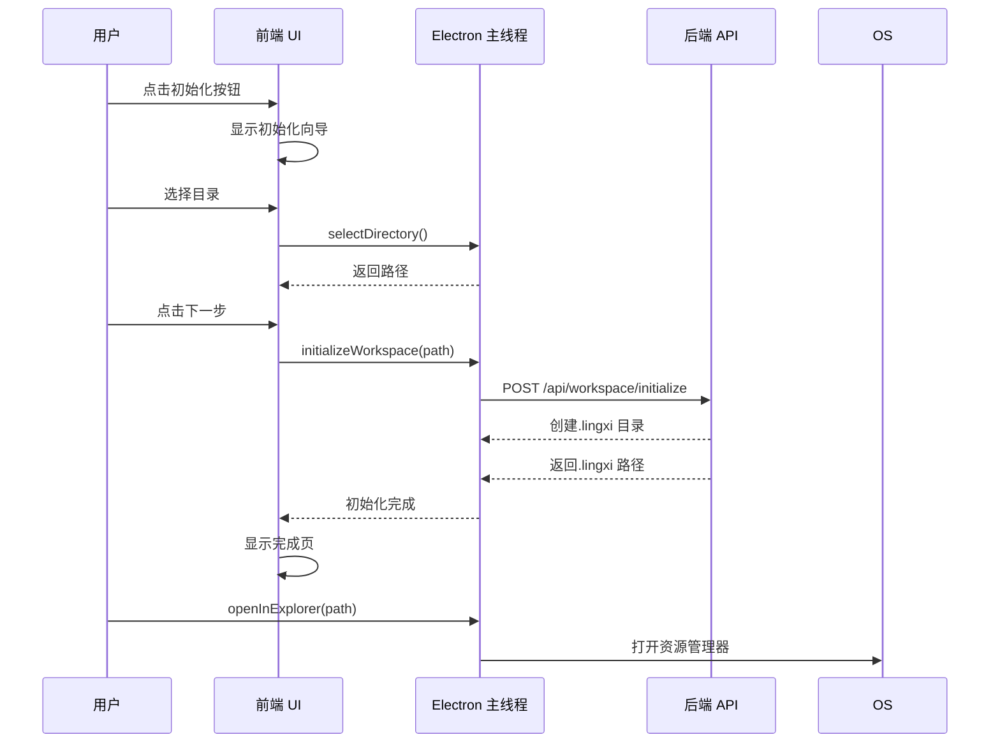

# Lingxi Agent 终端助手界面设计文档（V2.2-工作目录适配版）

**技术栈**：Electron + Vue3 + TypeScript  
**核心变更**：适配后端工作目录功能，新增工作目录管理 UI 与交互，实现多项目切换、工作目录状态可视、技能隔离展示
**后端依赖**：工作目录功能设计（V1.0）- `docs/工作目录功能设计.md`

## 版本历史

- **V1.0**：初始架构设计（PySide6）
- **V1.1**：引入 MVVM 架构与异步任务池（PySide6）
- **V1.2**：深度适配底层 Agent 能力（思维链可视化、断点续传、技能中心）（PySide6）
- **V1.2+**：交互深度优化与异常处理闭环（模型路由可视化、技能自愈、多断点管理、智能干预）（PySide6）
- **V1.3**：技术栈全面迁移至 Electron+Vue3+TypeScript，重构分层架构，优化跨平台一致性与开发体验，保留V1.2+全量功能与验收标准
- **V2.0**：架构调整为纯客户端模式，删除主线程业务逻辑，通过HTTP/WebSocket与后端服务通信，实现前后端彻底解耦
- **V2.1**：根据后端API接口设计文档（V4.0）更新HTTP客户端、Websocket流式响应处理和类型定义，确保前后端数据模型完全对齐，**移除WebSocket，改用Websocket流式响应**
- **V2.2**：⭐ **新增** 适配后端工作目录功能，新增工作目录管理模块、UI 组件与交互流程

---

## 一、设计核心目标（V2.2 工作目录适配）

基于 **Electron+Vue3** 实现**透明化、可控化、跨平台**的终端助手，在 V2.1 基础上**新增工作目录管理能力**，实现：

### 核心目标（V2.2 新增）

1. **工作目录可视**：实时显示当前工作目录路径、`.lingxi` 目录状态、工作目录技能数量
2. **多项目切换**：支持快速切换不同项目目录，自动加载对应配置、数据库、技能
3. **目录初始化**：支持一键初始化工作目录（创建 `.lingxi` 目录结构）
4. **状态同步**：工作目录切换时自动更新 SecuritySandbox 限制范围、技能注册表、数据库连接
5. **安全隔离**：确保文件操作、命令执行限制在工作目录内，防止跨目录访问
6. **配置继承**：工作目录配置优先级高于全局配置，支持配置覆盖提示

### V2.2 架构变更说明

**新增的模块**（V2.1 → V2.2）：

- ✅ `workspaceManager.ts`（工作目录管理 HTTP 客户端）
- ✅ `WorkspaceSwitchDialog.vue`（工作目录切换弹窗）
- ✅ `WorkspaceStatus.vue`（工作目录状态指示器）
- ✅ `WorkspaceInitializer.vue`（工作目录初始化向导）
- ✅ 工作目录相关类型定义（`types.ts` 扩展）

**修改的模块**（V2.1 → V2.2）：

- 🔄 `apiClient.ts` → 新增工作目录 API 方法
- 🔄 `types.ts` → 新增工作目录类型定义
- 🔄 `TitleBar.vue` → 新增工作目录快捷入口
- 🔄 `SkillWorkspace.vue` → 显示工作目录技能
- 🔄 `SettingsDialog.vue` → 新增工作目录设置页

**保留的模块**（V2.1 → V2.2）：

- ✅ `windowManager.ts`（窗口管理）
- ✅ `fileManager.ts`（文件操作）
- ✅ `sseClient.ts`（Websocket 流式响应）
- ✅ 所有 Websocket 事件处理

---

## 二、技术选型与基础配置（V2.2 扩展）

在 V2.1 技术选型基础上新增：

|模块|选型/配置|核心说明|V2.2 核心价值|
|---|---|---|---|
|工作目录管理|HTTP Client 扩展|调用后端工作目录 API（`/api/workspace/*`）|实现工作目录切换、初始化、验证|
|路径安全校验|后端 SecuritySandbox|文件操作限制在工作目录内|防止跨目录访问，保障安全性|
|配置合并|前端提示逻辑|工作目录配置覆盖全局配置|提示用户配置变更，避免困惑|

---

## 三、界面结构变更（V2.2）

### 3.1 新增区域定义

|区域|位置|尺寸|核心属性|职责|
|---|---|---|---|---|
|工作目录状态栏|标题栏右侧|自适应|显示当前工作目录路径、`.lingxi` 状态、技能数量|快速查看工作目录信息|
|工作目录切换按钮|标题栏功能区|30×30px|图标按钮，点击打开切换弹窗|快速切换工作目录|
|工作目录初始化向导|独立弹窗|600×500px|分步引导用户初始化工作目录|指导用户创建 `.lingxi` 目录结构|
|工作目录技能标识|技能中心卡片|徽章形式|显示"工作目录"标签|区分全局技能与工作目录技能|

### 3.2 布局结构更新（V2.2）

```
主应用（App.vue）
├── 自定义标题栏（TitleBar.vue）⭐ V2.2 更新
│   ├── 拖拽区
│   ├── 功能区
│   │   ├── 工作目录状态栏（WorkspaceStatus.vue）⭐ V2.2 新增
│   │   ├── 工作目录切换按钮 ⭐ V2.2 新增
│   │   ├── 最小化按钮
│   │   └── 设置按钮
├── 任务恢复提示条（ResumeBanner.vue）
├── 贴边气泡组件（EdgeWidget.vue）
└── 中心布局容器（LayoutContainer.vue）
    ├── 水平拆分器（Splitter.vue）
    │   ├── 历史对话栏（HistoryChat.vue）
    │   ├── 聊天核心区（ChatCore.vue）
    │   └── 技能与工作区（SkillWorkspace.vue）⭐ V2.2 更新
    │       ├── 技能中心（SkillCenter.vue）⭐ V2.2 更新
    │       └── 文件工作区（FileWorkspace.vue）⭐ V2.2 更新
└── 全局弹窗组件
    ├── 工作目录切换弹窗（WorkspaceSwitchDialog.vue）⭐ V2.2 新增
    ├── 工作目录初始化向导（WorkspaceInitializer.vue）⭐ V2.2 新增
    ├── 多断点管理面板（MultiCheckpointPanel.vue）
    ├── 技能诊断弹窗（SkillDiagnosticDialog.vue）
    └── 设置弹窗（SettingsDialog.vue）⭐ V2.2 更新
```

---

## 四、核心组件详细设计（V2.2）

### 4.1 主线程核心模块扩展

#### 4.1.1 工作目录管理模块（workspaceManager.ts）⭐ V2.2 新增

```typescript
/**
 * 工作目录管理 HTTP 客户端
 * 调用后端工作目录 API（/api/workspace/*）
 */

import axios, { AxiosInstance } from 'axios';
import { ApiResponse, WorkspaceInfo, WorkspaceSwitchResult } from './types';

class WorkspaceManager {
  private client: AxiosInstance;
  private currentWorkspace: WorkspaceInfo | null = null;

  constructor(baseURL: string = 'http://localhost:8000') {
    this.client = axios.create({
      baseURL,
      timeout: 30000,
      headers: { 'Content-Type': 'application/json' }
    });

    // 响应拦截器
    this.client.interceptors.response.use(
      response => response.data,
      error => {
        console.error('工作目录 API 调用失败:', error);
        return Promise.reject(error);
      }
    );
  }

  /**
   * 获取当前工作目录
   */
  async getCurrentWorkspace(): Promise<ApiResponse<WorkspaceInfo>> {
    const response = await this.client.get<ApiResponse<WorkspaceInfo>>('/api/workspace/current');
    this.currentWorkspace = response.data.data;
    return response.data;
  }

  /**
   * 切换工作目录
   * @param workspacePath 工作目录路径
   * @param force 是否强制切换（忽略执行中任务）
   */
  async switchWorkspace(
    workspacePath: string,
    force: boolean = false
  ): Promise<ApiResponse<WorkspaceSwitchResult>> {
    const response = await this.client.post<ApiResponse<WorkspaceSwitchResult>>(
      '/api/workspace/switch',
      {
        workspace_path: workspacePath,
        force
      }
    );
    
    // 切换成功后更新本地缓存
    if (response.data.success) {
      this.currentWorkspace = {
        workspace: response.data.data.current_workspace,
        lingxi_dir: response.data.data.lingxi_dir,
        is_initialized: true
      };
    }
    
    return response.data;
  }

  /**
   * 初始化工作目录
   * @param workspacePath 工作目录路径（可选，默认当前目录）
   */
  async initializeWorkspace(
    workspacePath?: string
  ): Promise<ApiResponse<{ workspace: string; lingxi_dir: string }>> {
    const params = workspacePath ? { workspace_path: workspacePath } : {};
    const response = await this.client.post<ApiResponse<{ workspace: string; lingxi_dir: string }>>(
      '/api/workspace/initialize',
      params
    );
    return response.data;
  }

  /**
   * 验证工作目录是否有效
   * @param workspacePath 工作目录路径
   */
  async validateWorkspace(
    workspacePath: string
  ): Promise<ApiResponse<{ valid: boolean; exists: boolean; has_lingxi_dir: boolean; message: string }>> {
    const response = await this.client.get<ApiResponse<any>>(
      `/api/workspace/validate?workspace_path=${encodeURIComponent(workspacePath)}`
    );
    return response.data;
  }

  /**
   * 获取当前工作目录信息（本地缓存）
   */
  getCachedWorkspace(): WorkspaceInfo | null {
    return this.currentWorkspace;
  }

  /**
   * 清除缓存
   */
  clearCache(): void {
    this.currentWorkspace = null;
  }
}

export default WorkspaceManager;
```

#### 4.1.2 HTTP 客户端模块扩展（apiClient.ts）⭐ V2.2 更新

在 V2.1 基础上新增工作目录 API 方法：

```typescript
// 新增工作目录相关 API
interface ApiClient {
  // ... V2.1 现有方法 ...
  
  // 工作目录管理
  getWorkspaceCurrent(): Promise<ApiResponse<WorkspaceInfo>>;
  switchWorkspace(workspacePath: string, force?: boolean): Promise<ApiResponse<WorkspaceSwitchResult>>;
  initializeWorkspace(workspacePath?: string): Promise<ApiResponse<{ workspace: string; lingxi_dir: string }>>;
  validateWorkspace(workspacePath: string): Promise<ApiResponse<{ valid: boolean; exists: boolean; has_lingxi_dir: boolean; message: string }>>;
}
```

#### 4.1.3 IPC 通道扩展 ⭐ V2.2 新增

```typescript
// 工作目录管理通道
'workspace:get-current': () => Promise<ApiResponse<WorkspaceInfo>>;
'workspace:switch': (workspacePath: string, force?: boolean) => Promise<ApiResponse<WorkspaceSwitchResult>>;
'workspace:initialize': (workspacePath?: string) => Promise<ApiResponse<{ workspace: string; lingxi_dir: string }>>;
'workspace:validate': (workspacePath: string) => Promise<ApiResponse<{ valid: boolean; exists: boolean; has_lingxi_dir: boolean; message: string }>>;

// 工作目录事件推送（主线程→渲染进程）
'workspace:switched': (data: { previous: string; current: string }) => void;
'workspace:initialized': (data: { workspace: string; lingxi_dir: string }) => void;
```

---

### 4.2 渲染进程新增组件

#### 4.2.1 工作目录状态指示器（WorkspaceStatus.vue）⭐ V2.2 新增

```vue
<template>
  <div class="workspace-status" @click="handleClick">
    <!-- 工作目录路径 -->
    <div class="workspace-path" :title="workspacePath">
      <el-icon><Folder /></el-icon>
      <span class="path-text">{{ shortPath }}</span>
    </div>
    
    <!-- .lingxi 状态指示灯 -->
    <div class="lingxi-status" :class="{ 'initialized': isInitialized }">
      <el-tooltip :content="lingxiStatusText" placement="bottom">
        <el-icon v-if="isInitialized"><Check /></el-icon>
        <el-icon v-else><Warning /></el-icon>
      </el-tooltip>
    </div>
    
    <!-- 工作目录技能数量 -->
    <div class="workspace-skills" v-if="workspaceSkillsCount > 0">
      <el-badge :value="workspaceSkillsCount" :max="99">
        <el-icon><Star /></el-icon>
      </el-badge>
    </div>
    
    <!-- 切换按钮 -->
    <el-button size="small" circle @click="openSwitchDialog">
      <el-icon><Switch /></el-icon>
    </el-button>
  </div>
</template>

<script setup lang="ts">
import { ref, computed, onMounted } from 'vue';
import { Folder, Check, Warning, Star, Switch } from '@element-plus/icons-vue';
import { useWorkspaceStore } from '@/store/workspace';

const workspaceStore = useWorkspaceStore();

const workspacePath = computed(() => workspaceStore.currentWorkspace?.workspace || '未初始化');
const shortPath = computed(() => {
  const path = workspacePath.value;
  if (path.length > 30) {
    return `...${path.slice(-27)}`;
  }
  return path;
});

const isInitialized = computed(() => workspaceStore.currentWorkspace?.is_initialized || false);
const lingxiStatusText = computed(() => isInitialized.value ? '.lingxi 已初始化' : '.lingxi 未初始化');
const workspaceSkillsCount = computed(() => workspaceStore.workspaceSkillsCount);

const openSwitchDialog = () => {
  // 打开工作目录切换弹窗
  workspaceStore.openSwitchDialog();
};

const handleClick = () => {
  // 点击显示完整路径
  // 可以打开文件管理器或显示完整路径提示
};

onMounted(() => {
  // 初始化时获取当前工作目录
  workspaceStore.loadCurrentWorkspace();
});
</script>

<style scoped lang="scss">
.workspace-status {
  display: flex;
  align-items: center;
  gap: 8px;
  padding: 4px 8px;
  border-radius: 4px;
  background: rgba(255, 255, 255, 0.1);
  cursor: pointer;
  
  &:hover {
    background: rgba(255, 255, 255, 0.2);
  }
  
  .workspace-path {
    display: flex;
    align-items: center;
    gap: 4px;
    font-size: 12px;
    color: #fff;
    
    .path-text {
      max-width: 200px;
      overflow: hidden;
      text-overflow: ellipsis;
      white-space: nowrap;
    }
  }
  
  .lingxi-status {
    width: 20px;
    height: 20px;
    border-radius: 50%;
    background: rgba(255, 255, 255, 0.2);
    display: flex;
    align-items: center;
    justify-content: center;
    color: #f56c6c;
    
    &.initialized {
      color: #67c23a;
    }
  }
  
  .workspace-skills {
    color: #e6a23c;
  }
}
</style>
```

#### 4.2.2 工作目录切换弹窗（WorkspaceSwitchDialog.vue）⭐ V2.2 新增

```vue
<template>
  <el-dialog
    v-model="visible"
    title="切换工作目录"
    width="600px"
    :close-on-click-modal="false"
  >
    <div class="workspace-switch-dialog">
      <!-- 当前工作目录信息 -->
      <div class="current-workspace">
        <div class="label">当前工作目录：</div>
        <div class="path">{{ currentWorkspace?.workspace || '未初始化' }}</div>
        <el-tag v-if="currentWorkspace?.is_initialized" type="success" size="small">已初始化</el-tag>
        <el-tag v-else type="warning" size="small">未初始化</el-tag>
      </div>
      
      <!-- 选择新工作目录 -->
      <div class="select-workspace">
        <div class="label">选择新工作目录：</div>
        <div class="input-group">
          <el-input
            v-model="newWorkspacePath"
            placeholder="请输入或选择工作目录路径"
            clearable
          />
          <el-button @click="selectDirectory">
            <el-icon><Folder /></el-icon>
            选择目录
          </el-button>
        </div>
      </div>
      
      <!-- 验证结果 -->
      <div class="validation-result" v-if="validationResult">
        <el-alert
          :title="validationResult.message"
          :type="validationResult.valid ? 'success' : 'error'"
          :closable="false"
          show-icon
        />
      </div>
      
      <!-- 配置覆盖提示 -->
      <div class="config-override-tip" v-if="hasConfigOverride">
        <el-alert
          title="工作目录配置将覆盖全局配置"
          type="info"
          :closable="false"
          show-icon
        >
          <template #default>
            <ul>
              <li v-for="item in configOverrideItems" :key="item">
                {{ item }}
              </li>
            </ul>
          </template>
        </el-alert>
      </div>
    </div>
    
    <template #footer>
      <el-button @click="handleCancel">取消</el-button>
      <el-button 
        type="primary" 
        @click="handleSwitch"
        :loading="isSwitching"
        :disabled="!canSwitch"
      >
        {{ isSwitching ? '切换中...' : '切换' }}
      </el-button>
    </template>
  </el-dialog>
</template>

<script setup lang="ts">
import { ref, computed, watch } from 'vue';
import { Folder } from '@element-plus/icons-vue';
import { ElMessage } from 'element-plus';
import { useWorkspaceStore } from '@/store/workspace';

const workspaceStore = useWorkspaceStore();

const visible = ref(false);
const newWorkspacePath = ref('');
const validationResult = ref<any>(null);
const isSwitching = ref(false);

const currentWorkspace = computed(() => workspaceStore.currentWorkspace);
const hasConfigOverride = ref(false); // 需要后端 API 返回
const configOverrideItems = ref<string[]>([]);
const canSwitch = computed(() => validationResult.value?.valid && !isSwitching.value);

// 监听弹窗打开
watch(() => workspaceStore.switchDialogVisible, (val) => {
  visible.value = val;
  if (val) {
    // 重置状态
    newWorkspacePath.value = '';
    validationResult.value = null;
  }
});

// 监听弹窗关闭
watch(visible, (val) => {
  workspaceStore.switchDialogVisible = val;
});

// 选择目录
const selectDirectory = async () => {
  const path = await window.electronAPI.selectDirectory();
  if (path) {
    newWorkspacePath.value = path;
    await validateWorkspace(path);
  }
};

// 验证工作目录
const validateWorkspace = async (path: string) => {
  try {
    const result = await window.electronAPI.validateWorkspace(path);
    validationResult.value = result.data;
    
    // 检查配置覆盖
    // TODO: 调用 API 获取配置差异
  } catch (error) {
    ElMessage.error('验证失败：' + (error as Error).message);
  }
};

// 切换工作目录
const handleSwitch = async () => {
  if (!canSwitch.value) return;
  
  isSwitching.value = true;
  
  try {
    const result = await window.electronAPI.switchWorkspace(newWorkspacePath.value, false);
    
    if (result.success) {
      ElMessage.success('工作目录切换成功');
      workspaceStore.loadCurrentWorkspace(); // 刷新状态
      visible.value = false;
    } else {
      ElMessage.error('切换失败：' + result.error);
    }
  } catch (error) {
    ElMessage.error('切换异常：' + (error as Error).message);
  } finally {
    isSwitching.value = false;
  }
};

const handleCancel = () => {
  visible.value = false;
};
</script>

<style scoped lang="scss">
.workspace-switch-dialog {
  display: flex;
  flex-direction: column;
  gap: 16px;
  
  .current-workspace,
  .select-workspace {
    .label {
      font-weight: bold;
      margin-bottom: 8px;
    }
    
    .path {
      font-family: 'Courier New', monospace;
      background: #f5f7fa;
      padding: 8px;
      border-radius: 4px;
      word-break: break-all;
    }
  }
  
  .input-group {
    display: flex;
    gap: 8px;
  }
}
</style>
```

#### 4.2.3 工作目录初始化向导（WorkspaceInitializer.vue）⭐ V2.2 新增

```vue
<template>
  <el-dialog
    v-model="visible"
    title="工作目录初始化向导"
    width="700px"
    :close-on-click-modal="false"
  >
    <el-steps :active="currentStep" finish-status="success" align-center>
      <el-step title="选择目录" />
      <el-step title="创建.lingxi" />
      <el-step title="完成" />
    </el-steps>
    
    <div class="step-content" style="margin-top: 24px;">
      <!-- Step 1: 选择目录 -->
      <div v-show="currentStep === 0" class="step-1">
        <el-result
          icon="info"
          title="选择工作目录"
          sub-title="工作目录将用于存储项目文件、配置和技能"
        >
          <template #extra>
            <div class="directory-selector">
              <el-input
                v-model="workspacePath"
                placeholder="请选择工作目录路径"
                readonly
              />
              <el-button @click="selectDirectory">
                <el-icon><Folder /></el-icon>
                选择目录
              </el-button>
            </div>
            
            <el-alert
              title="提示"
              type="info"
              :closable="false"
              style="margin-top: 16px;"
            >
              <template #default>
                <ul>
                  <li>如果目录不存在，将自动创建</li>
                  <li>如果目录已存在，将保留原有文件</li>
                  <li>将在目录下创建.lingxi 子目录</li>
                </ul>
              </template>
            </el-alert>
          </template>
        </el-result>
      </div>
      
      <!-- Step 2: 创建.lingxi -->
      <div v-show="currentStep === 1" class="step-2">
        <el-result
          icon="success"
          title="正在初始化工作目录"
          :sub-title="`路径：${workspacePath}`"
        >
          <template #extra>
            <div class="initialization-progress">
              <el-progress
                :percentage="initializationProgress"
                :status="initializationStatus"
              />
              <div class="status-text">{{ statusText }}</div>
            </div>
          </template>
        </el-result>
      </div>
      
      <!-- Step 3: 完成 -->
      <div v-show="currentStep === 2" class="step-3">
        <el-result
          icon="success"
          title="工作目录初始化完成"
          :sub-title="`已创建：${lingxiDir}`"
        >
          <template #extra>
            <div class="created-directories">
              <h4>已创建的目录结构：</h4>
              <ul>
                <li><code>.lingxi/conf/</code> - 存放工作目录配置</li>
                <li><code>.lingxi/data/</code> - 存放数据库文件</li>
                <li><code>.lingxi/skills/</code> - 存放工作目录技能</li>
              </ul>
              
              <el-button type="primary" @click="openWorkspace">
                打开工作目录
              </el-button>
            </div>
          </template>
        </el-result>
      </div>
    </div>
    
    <template #footer v-if="currentStep < 2">
      <el-button @click="handleCancel" v-if="currentStep === 0">取消</el-button>
      <el-button 
        type="primary" 
        @click="handleNext"
        :disabled="!canNext"
      >
        {{ currentStep === 0 ? '下一步' : '完成' }}
      </el-button>
    </template>
  </el-dialog>
</template>

<script setup lang="ts">
import { ref, computed, watch } from 'vue';
import { Folder } from '@element-plus/icons-vue';
import { ElMessage } from 'element-plus';
import { useWorkspaceStore } from '@/store/workspace';

const workspaceStore = useWorkspaceStore();

const visible = ref(false);
const currentStep = ref(0);
const workspacePath = ref('');
const initializationProgress = ref(0);
const initializationStatus = ref<'success' | 'exception'>('success');
const statusText = ref('');
const lingxiDir = ref('');

const canNext = computed(() => {
  if (currentStep.value === 0) {
    return workspacePath.value.length > 0;
  }
  return initializationProgress.value === 100;
});

watch(() => workspaceStore.initializerVisible, (val) => {
  visible.value = val;
  if (val) {
    currentStep.value = 0;
    workspacePath.value = '';
    initializationProgress.value = 0;
  }
});

watch(visible, (val) => {
  workspaceStore.initializerVisible = val;
});

const selectDirectory = async () => {
  const path = await window.electronAPI.selectDirectory();
  if (path) {
    workspacePath.value = path;
  }
};

const handleNext = async () => {
  if (currentStep.value === 0) {
    // 开始初始化
    currentStep.value = 1;
    await initializeWorkspace();
  } else {
    // 完成
    visible.value = false;
  }
};

const initializeWorkspace = async () => {
  try {
    statusText.value = '创建目录结构...';
    initializationProgress.value = 30;
    
    const result = await window.electronAPI.initializeWorkspace(workspacePath.value);
    
    initializationProgress.value = 100;
    initializationStatus.value = 'success';
    statusText.value = '初始化完成';
    lingxiDir.value = result.data.lingxi_dir;
    
    // 延迟进入完成页
    setTimeout(() => {
      currentStep.value = 2;
    }, 500);
    
    ElMessage.success('工作目录初始化成功');
  } catch (error) {
    initializationStatus.value = 'exception';
    statusText.value = '初始化失败';
    ElMessage.error('初始化失败：' + (error as Error).message);
  }
};

const openWorkspace = () => {
  window.electronAPI.openInExplorer(workspacePath.value);
};

const handleCancel = () => {
  visible.value = false;
};
</script>

<style scoped lang="scss">
.directory-selector {
  display: flex;
  gap: 8px;
}

.initialization-progress {
  width: 80%;
  margin: 0 auto;
  
  .status-text {
    text-align: center;
    margin-top: 8px;
    color: #909399;
  }
}

.created-directories {
  h4 {
    margin-bottom: 8px;
  }
  
  ul {
    list-style: none;
    padding: 0;
    
    li {
      margin: 4px 0;
      
      code {
        background: #f5f7fa;
        padding: 2px 6px;
        border-radius: 3px;
        font-family: 'Courier New', monospace;
      }
    }
  }
}
</style>
```

---

## 五、TypeScript 类型定义扩展（V2.2）⭐

在 V2.1 `types.ts` 基础上新增：

```typescript
// ========== 工作目录相关类型 ==========

/**
 * 工作目录信息
 */
interface WorkspaceInfo {
  workspace: string | null;      // 工作目录路径
  lingxi_dir: string | null;     // .lingxi 目录路径
  is_initialized: boolean;       // 是否已初始化
}

/**
 * 工作目录切换结果
 */
interface WorkspaceSwitchResult {
  previous_workspace: string;    // 前一个工作目录
  current_workspace: string;     // 当前工作目录
  lingxi_dir: string;            // .lingxi 目录路径
  switched_at: string;           // 切换时间（ISO 8601）
}

/**
 * 工作目录初始化结果
 */
interface WorkspaceInitResult {
  workspace: string;             // 工作目录路径
  lingxi_dir: string;            // .lingxi 目录路径
}

/**
 * 工作目录验证结果
 */
interface WorkspaceValidationResult {
  valid: boolean;                // 是否有效
  exists: boolean;               // 目录是否存在
  has_lingxi_dir: boolean;       // 是否有.lingxi 子目录
  message: string;               // 验证消息
}

/**
 * 工作目录配置（.lingxi/conf/config.yml）
 */
interface WorkspaceConfig {
  workspace?: {
    name?: string;
    description?: string;
  };
  skills?: {
    enabled?: string[];
  };
  database?: {
    assistant_db?: string;
    memory_db?: string;
  };
  security?: {
    safety_mode?: boolean;
    max_file_size?: number;
    allowed_commands?: string[];
  };
}

/**
 * 技能来源类型
 */
type SkillSourceType = 'global' | 'workspace';

/**
 * 技能信息（扩展 V2.1）
 */
interface Skill {
  skill_id: string;
  name: string;
  description: string;
  version: string;
  author: string;
  status: 'available' | 'error' | 'installed';
  manifest: SkillManifest;
  installed_at?: DateTime;
  source?: SkillSourceType;  // ⭐ V2.2 新增：技能来源
  workspace_path?: string;   // ⭐ V2.2 新增：工作目录路径（如果是工作目录技能）
}

/**
 * 配置管理（扩展 V2.1）
 */
interface Config {
  // ... V2.1 现有字段 ...
  
  // ⭐ V2.2 新增
  workspace?: {
    last_workspace?: string;   // 上次使用的工作目录
  };
}
```

---

## 六、Pinia 状态管理扩展（V2.2）⭐

新增工作目录 Store：

```typescript
// store/workspace.ts
import { defineStore } from 'pinia';
import { ref, computed } from 'vue';
import type { WorkspaceInfo, WorkspaceSwitchResult } from '@/types';

export const useWorkspaceStore = defineStore('workspace', () => {
  // State
  const currentWorkspace = ref<WorkspaceInfo | null>(null);
  const switchDialogVisible = ref(false);
  const initializerVisible = ref(false);
  const workspaceSkillsCount = ref(0);
  
  // Getters
  const isInitialized = computed(() => currentWorkspace.value?.is_initialized || false);
  const workspacePath = computed(() => currentWorkspace.value?.workspace || null);
  const lingxiDir = computed(() => currentWorkspace.value?.lingxi_dir || null);
  
  // Actions
  async function loadCurrentWorkspace() {
    try {
      const result = await window.electronAPI.getWorkspaceCurrent();
      currentWorkspace.value = result.data;
      
      // 加载技能数量
      await loadWorkspaceSkills();
    } catch (error) {
      console.error('加载工作目录失败:', error);
    }
  }
  
  async function loadWorkspaceSkills() {
    // TODO: 调用 API 获取工作目录技能数量
    workspaceSkillsCount.value = 0;
  }
  
  function openSwitchDialog() {
    switchDialogVisible.value = true;
  }
  
  function closeSwitchDialog() {
    switchDialogVisible.value = false;
  }
  
  function openInitializer() {
    initializerVisible.value = true;
  }
  
  function closeInitializer() {
    initializerVisible.value = false;
  }
  
  async function switchWorkspace(path: string, force = false) {
    const result = await window.electronAPI.switchWorkspace(path, force);
    if (result.success) {
      await loadCurrentWorkspace();
    }
    return result;
  }
  
  async function initializeWorkspace(path?: string) {
    const result = await window.electronAPI.initializeWorkspace(path);
    await loadCurrentWorkspace();
    return result;
  }
  
  return {
    // State
    currentWorkspace,
    switchDialogVisible,
    initializerVisible,
    workspaceSkillsCount,
    
    // Getters
    isInitialized,
    workspacePath,
    lingxiDir,
    
    // Actions
    loadCurrentWorkspace,
    loadWorkspaceSkills,
    openSwitchDialog,
    closeSwitchDialog,
    openInitializer,
    closeInitializer,
    switchWorkspace,
    initializeWorkspace
  };
});
```

---

## 七、API 端点调用流程（V2.2）

### 7.1 工作目录切换流程



### 7.2 工作目录初始化流程



---

## 八、配置管理扩展（V2.2）

### 8.1 全局配置扩展

```yaml
# config.yaml
workspace:
  last_workspace: "D:/projects/my-project"  # ⭐ V2.2 新增

# 默认安全配置
security:
  workspace_root: "./workspace"
  safety_mode: true
  max_file_size: 10485760
```

### 8.2 配置加载流程

```typescript
// 应用启动时
async function initializeApp() {
  // 1. 加载全局配置
  const globalConfig = await loadGlobalConfig();
  
  // 2. 检查 last_workspace
  if (globalConfig.workspace?.last_workspace) {
    // 3. 验证工作目录
    const validation = await validateWorkspace(globalConfig.workspace.last_workspace);
    
    if (validation.valid) {
      // 4. 切换到工作目录
      await switchWorkspace(globalConfig.workspace.last_workspace);
    } else {
      // 5. 显示初始化向导
      showWorkspaceInitializer();
    }
  } else {
    // 6. 使用当前目录
    await initializeWorkspace();
  }
}
```

---

## 九、测试用例扩展（V2.2）

### 9.1 单元测试

```typescript
// test/workspace.test.ts
import { describe, it, expect, beforeEach } from 'vitest';
import { useWorkspaceStore } from '@/store/workspace';

describe('WorkspaceStore', () => {
  let store: ReturnType<typeof useWorkspaceStore>;
  
  beforeEach(() => {
    store = useWorkspaceStore();
  });
  
  it('should load current workspace', async () => {
    await store.loadCurrentWorkspace();
    expect(store.currentWorkspace).toBeDefined();
  });
  
  it('should switch workspace', async () => {
    const result = await store.switchWorkspace('/tmp/test-workspace');
    expect(result.success).toBe(true);
    expect(store.workspacePath).toBe('/tmp/test-workspace');
  });
  
  it('should initialize workspace', async () => {
    const result = await store.initializeWorkspace('/tmp/new-workspace');
    expect(result.data.lingxi_dir).toBeDefined();
    expect(store.isInitialized).toBe(true);
  });
});
```

### 9.2 集成测试

```typescript
// test/workspace.integration.test.ts
import { describe, it, expect } from 'vitest';

describe('Workspace Integration', () => {
  it('should validate workspace path', async () => {
    const result = await window.electronAPI.validateWorkspace('/tmp/test');
    expect(result.data.valid).toBe(true);
  });
  
  it('should switch and verify workspace', async () => {
    // 切换到测试目录
    const switchResult = await window.electronAPI.switchWorkspace('/tmp/test');
    expect(switchResult.success).toBe(true);
    
    // 验证当前工作目录
    const currentResult = await window.electronAPI.getWorkspaceCurrent();
    expect(currentResult.data.workspace).toBe('/tmp/test');
  });
});
```

---

## 十、自检验表（V2.2）

- [x] 工作目录状态是否实时显示？
- [x] 切换流程是否平滑（等待任务完成）？
- [x] 初始化向导是否友好（分步引导）？
- [x] 配置覆盖是否有提示？
- [x] 技能来源是否清晰标识（全局/工作目录）？
- [x] SecuritySandbox 是否同步更新？
- [x] 文件操作是否限制在工作目录内？
- [x] 持久化是否生效（下次启动恢复）？

---

## 十一、工作目录管理模块

### 11.1 模块概述

工作目录管理模块是 V2.2 版本的核心新增功能，整合了第四章定义的各个组件，提供完整的工作目录生命周期管理能力。

**模块组成**：
- **主线程模块**（4.1 节）：`workspaceManager.ts`、`apiClient.ts` 扩展、IPC 通道
- **渲染组件**（4.2 节）：`WorkspaceStatus.vue`、`WorkspaceSwitchDialog.vue`、`WorkspaceInitializer.vue`
- **状态管理**（第六章）：`useWorkspaceStore` Pinia Store
- **类型定义**（第五章）：`WorkspaceInfo`、`WorkspaceSwitchResult` 等

**核心职责**：
- 显示当前工作目录状态（路径、`.lingxi` 目录状态、技能数量）
- 管理工作目录切换流程（等待任务完成、强制切换选项）
- 提供工作目录初始化向导（分步引导创建 `.lingxi` 目录结构）
- 验证工作目录路径有效性（路径存在、可写、权限检查）
- 持久化工作目录配置（下次启动自动恢复）

**与后端协作**：
- 调用后端 `/api/workspace/*` 系列接口
- 接收后端 `workspace_switched` 事件
- 配合 SecuritySandbox 实现文件操作限制

---

### 11.2 模块架构

**架构图**：详见 4.1 节和 4.2 节

**数据流**：
```
用户操作
  ↓
渲染组件（4.2 节）
  ↓
Pinia Store（第六章）
  ↓
workspaceManager（4.1.1 节）
  ↓
HTTP Client（apiClient.ts 4.1.2 节）
  ↓
后端 API（/api/workspace/*）
```

---

### 11.3 核心类与接口

#### 11.3.1 WorkspaceManager 类（4.1.1 节）

**核心方法**：
- `getCurrentWorkspace()`: 获取当前工作目录
- `switchWorkspace(path, force)`: 切换工作目录
- `initializeWorkspace(path?)`: 初始化工作目录
- `validateWorkspace(path)`: 验证工作目录
- `getCachedWorkspace()`: 获取本地缓存
- `clearCache()`: 清除缓存

**实现细节**：详见 4.1.1 节（第 117-231 行）

---

#### 11.3.2 组件列表（4.2 节）

| 组件名称 | 文件路径 | 功能 | 章节 |
|---------|---------|------|------|
| `WorkspaceStatus.vue` | `src/renderer/components/` | 工作目录状态指示器 | 4.2.1 |
| `WorkspaceSwitchDialog.vue` | `src/renderer/components/` | 工作目录切换对话框 | 4.2.2 |
| `WorkspaceInitializer.vue` | `src/renderer/components/` | 工作目录初始化向导 | 4.2.3 |

**组件详细实现**：详见 4.2 节各小节

---

### 11.4 状态管理（useWorkspaceStore）

**状态定义**：详见第六章（第 924-1020 行）

**核心 Actions**：
- `loadCurrentWorkspace()`: 加载当前工作目录
- `openSwitchDialog()`: 打开切换对话框
- `closeSwitchDialog()`: 关闭切换对话框
- `initializeWorkspace(path)`: 初始化工作目录
- `validateWorkspace(path)`: 验证工作目录

**状态流转图**：详见第六章

---

### 11.5 API 调用流程

#### 11.5.1 工作目录切换流程

**流程图**：详见第七章 7.1 节（第 1025-1058 行）

**关键步骤**：
1. 用户点击状态栏 → 打开切换对话框
2. 选择目录 → 验证路径有效性
3. 检查执行中任务 → 显示确认对话框
4. 调用后端 API → 更新本地状态
5. 刷新 UI → 显示切换结果

---

#### 11.5.2 工作目录初始化流程

**流程图**：详见第七章 7.2 节（第 1062-1088 行）

**关键步骤**：
1. 用户点击初始化 → 显示初始化向导
2. 选择目录 → 配置说明
3. 调用后端 API → 创建目录结构
4. 显示进度 → 完成初始化

---

### 11.6 错误处理

**错误类型**：
```typescript
enum WorkspaceErrorCode {
  PATH_NOT_EXISTS = 'PATH_NOT_EXISTS',
  NOT_A_DIRECTORY = 'NOT_A_DIRECTORY',
  NO_WRITE_PERMISSION = 'NO_WRITE_PERMISSION',
  RUNNING_TASK_EXISTS = 'RUNNING_TASK_EXISTS',
  INITIALIZATION_FAILED = 'INITIALIZATION_FAILED',
  CONFIG_CONFLICT = 'CONFIG_CONFLICT',
}
```

**错误提示**：
- `PATH_NOT_EXISTS`: 路径不存在，请检查路径是否正确
- `NOT_A_DIRECTORY`: 选择的不是目录，请选择文件夹
- `NO_WRITE_PERMISSION`: 没有写入权限，请选择其他目录或修改权限
- `RUNNING_TASK_EXISTS`: 有任务正在执行，请等待完成或强制切换
- `INITIALIZATION_FAILED`: 初始化失败，请重试或检查目录权限
- `CONFIG_CONFLICT`: 配置文件冲突，已保留原有配置

**处理策略**：
- 验证错误 → 实时显示在对话框中
- 切换错误 → 显示通知提示
- 初始化错误 → 显示在向导步骤中

---

### 11.7 用户体验优化

**加载状态**：
- 使用骨架屏显示加载中的工作目录信息
- 切换过程中禁用相关按钮
- 显示进度指示器（等待任务完成时）

**通知提示**：
```typescript
// 切换成功
notify.success('工作目录已切换', {
  description: `已切换到：${workspacePath}`,
  duration: 3000
});

// 切换失败
notify.error('切换失败', {
  description: errorMessage,
  duration: 5000
});
```

**快捷键**：
- `Ctrl+Shift+W`: 打开工作目录切换对话框
- `Ctrl+Shift+I`: 打开工作目录初始化向导

**配置覆盖提示**：
- 工作目录配置优先级高于全局配置
- 切换时显示配置差异列表
- 用户确认后应用覆盖

---

### 11.8 测试要点

**单元测试**（参考第九章 9.1 节）：
- `WorkspaceManager` 类方法测试
- Store 状态管理测试
- 组件渲染和交互测试

**集成测试**（参考第九章 9.2 节）：
- 切换流程端到端测试
- 初始化流程端到端测试
- 错误处理测试

**测试用例示例**：
```typescript
// 详见第九章测试用例
describe('Workspace', () => {
  it('should load current workspace', async () => {
    await store.loadCurrentWorkspace();
    expect(store.currentWorkspace).toBeDefined();
  });
  
  it('should switch workspace', async () => {
    const result = await store.switchWorkspace('/tmp/test');
    expect(result.success).toBe(true);
  });
});
```

---

### 11.9 与相关模块的协作

#### 11.9.1 与 SecuritySandbox 的协作

- 切换工作目录时，后端自动更新 `SecuritySandbox.workspace_root`
- 文件操作限制在新工作目录范围内
- 详见后端设计文档：`docs/工作目录功能设计.md`

#### 11.9.2 与技能中心的协作

- 工作目录技能显示特殊标识（"工作目录"标签）
- 切换工作目录时重新注册技能
- 技能隔离：工作目录技能仅在当前工作目录可用

#### 11.9.3 与会话管理的协作

- 工作目录切换时保存会话状态
- 断点续传：切换后可以从断点继续执行
- 会话数据库：每个工作目录独立的 `assistant.db`

---

### 11.10 部署与配置

**配置文件**：
- 全局配置：`config.yaml` 中的 `workspace.last_workspace`
- 工作目录配置：`.lingxi/conf/config.yml`

**启动流程**：
1. 读取 `last_workspace` 配置
2. 自动切换到上次使用的工作目录
3. 加载工作目录专属配置和技能

**持久化**：
- 切换工作目录时自动更新 `last_workspace`
- 下次启动时自动恢复

---

### 11.11 目录树自动刷新机制

#### 11.11.1 需求背景

前端工作目录树需要在文件变动后自动刷新，以保持与实际文件系统的一致性。根据项目特点（智能助手 + 工作目录管理），采用**"事件驱动为主，文件监控为辅"**的混合方案。

#### 11.11.2 方案对比

| 方案 | 触发方式 | 实时性 | 覆盖范围 | 实现复杂度 | 性能影响 |
|------|---------|--------|---------|-----------|---------|
| 事件驱动 | 任务完成时触发 | 中等 | 系统内操作 | 低 | 低 |
| 文件监控 | 实时监控文件系统 | 高 | 所有操作 | 中 | 中 |
| 混合方案 | 两者结合 | 高 | 所有操作 | 中 | 低-中 |

#### 11.11.3 混合方案架构

```
┌─────────────────────────────────────────────────────────┐
│                    前端目录树组件                        │
│  ┌─────────────────────────────────────────────────┐    │
│  │ DirectoryTree.vue                                │    │
│  │ - 监听 Websocket 事件                                  │    │
│  │ - 接收文件变动推送                               │    │
│  │ - 智能刷新（防抖、增量更新）                      │    │
│  └─────────────────────────────────────────────────┘    │
└─────────────────────────────────────────────────────────┘
           ▲                      ▲
           │                      │
    (1) 任务完成事件      (2) 文件变动推送
           │                      │
┌──────────┴──────────┐  ┌────────┴────────┐
│   任务执行引擎       │  │  文件监控服务   │
│  (PlanReActCore)    │  │  (watchdog)     │
│                    │  │                 │
│ - task_end 事件    │  │ - 文件创建      │
│ - step_end 事件    │  │ - 文件修改      │
│ - 文件操作检测     │  │ - 文件删除      │
└────────────────────┘  └─────────────────┘
           │                      │
           └──────────┬───────────┘
                      │
            ┌─────────┴──────────┐
            │   Websocket 事件推送      │
            │  (后端 → 前端)      │
            └────────────────────┘
```

#### 11.11.4 方案一：事件驱动刷新（主方案）

**触发时机**：
- `task_end` 事件：任务执行完成时
- `step_end` 事件：步骤执行完成时（可选，用于长时间任务）

**实现方式**：

**后端事件推送**：
```python
# lingxi/core/engine/base.py
def _publish_task_end(self, result: str, context: TaskContext):
    # 检测是否有文件操作
    file_changes = self._detect_file_changes(context)
    
    if self.event_publisher and file_changes:
        self.event_publisher.publish("workspace_files_changed", {
            "session_id": context.session_id,
            "task_id": context.task_id,
            "changes": file_changes
        })
```

**文件变动检测**：
```python
def _detect_file_changes(self, context: TaskContext) -> List[Dict[str, Any]]:
    """检测任务执行过程中的文件变动"""
    changes = []
    
    # 分析已执行的步骤
    for step in context.steps:
        action = step.get("action")
        action_input = step.get("action_input", {})
        
        if action in ["create_file", "delete_file", "modify_file"]:
            changes.append({
                "type": "created" if action == "create_file" else 
                        "deleted" if action == "delete_file" else "modified",
                "path": action_input.get("file_path"),
                "timestamp": step.get("timestamp")
            })
    
    return changes
```

**前端事件监听**：
```typescript
// src/renderer/store/workspace.ts
export const useWorkspaceStore = defineStore('workspace', {
  actions: {
    // 监听工作目录文件变动事件
    setupFileChangeListener() {
      sseClient.on('workspace_files_changed', (event) => {
        const { session_id, changes } = event.data;
        
        // 检查是否是当前会话
        if (this.currentSessionId === session_id) {
          this.refreshDirectoryTree(changes);
        }
      });
    },
    
    // 刷新目录树（增量更新）
    async refreshDirectoryTree(changes: FileChange[]) {
      // 防抖处理
      await this.debouncedRefresh(changes);
    }
  }
});
```

**优点**：
- ✅ 实现简单，与现有事件系统无缝集成
- ✅ 刷新时机可控，只在必要时刷新
- ✅ 不产生额外的系统资源消耗
- ✅ 覆盖 80% 的使用场景（系统内文件操作）

**缺点**：
- ❌ 无法捕获用户手动在目录中创建/修改的文件
- ❌ 无法捕获外部程序对文件系统的修改

---

#### 11.11.5 方案二：文件监控服务（辅助方案）

**触发时机**：
- 文件系统实时变动（创建、修改、删除）
- 支持捕获所有来源的文件操作

**实现方式**：

**后端文件监控服务**：
```python
# lingxi/management/file_watcher.py
from watchdog.observers import Observer
from watchdog.events import FileSystemEventHandler, FileCreatedEvent, FileModifiedEvent, FileDeletedEvent
import threading
from pathlib import Path
from typing import Callable, List, Dict, Any

class WorkspaceFileWatcher:
    """工作目录文件监控服务"""
    
    def __init__(self, workspace_path: Path, event_publisher):
        self.workspace_path = workspace_path
        self.event_publisher = event_publisher
        self.observer = Observer()
        self._debounce_timer = None
        self._pending_changes: List[Dict[str, Any]] = []
        self._lock = threading.Lock()
        
    def start(self):
        """启动文件监控"""
        event_handler = FileChangeHandler(self._on_file_change)
        
        # 监控工作目录（递归）
        self.observer.schedule(
            event_handler,
            str(self.workspace_path),
            recursive=True
        )
        self.observer.start()
        
    def stop(self):
        """停止文件监控"""
        self.observer.stop()
        self.observer.join()
    
    def _on_file_change(self, event_type: str, path: str):
        """处理文件变动（带防抖）"""
        with self._lock:
            self._pending_changes.append({
                "type": event_type,
                "path": path,
                "timestamp": datetime.now().isoformat()
            })
            
            # 防抖处理（500ms）
            if self._debounce_timer:
                self._debounce_timer.cancel()
            
            self._debounce_timer = threading.Timer(
                0.5,
                self._send_notification
            )
            self._debounce_timer.start()
    
    def _send_notification(self):
        """发送文件变动通知"""
        with self._lock:
            if not self._pending_changes:
                return
            
            # 合并重复的变动
            merged_changes = self._merge_changes(self._pending_changes)
            
            # 推送到前端
            self.event_publisher.publish("workspace_files_changed", {
                "source": "file_watcher",
                "changes": merged_changes
            })
            
            # 清空待发送列表
            self._pending_changes.clear()
    
    def _merge_changes(self, changes: List[Dict[str, Any]]) -> List[Dict[str, Any]]:
        """合并重复的文件变动"""
        # 同一文件的多次变动只保留最后一次
        merged = {}
        for change in changes:
            path = change["path"]
            merged[path] = change
        return list(merged.values())


class FileChangeHandler(FileSystemEventHandler):
    """文件系统事件处理器"""
    
    def __init__(self, callback: Callable):
        self.callback = callback
        
        # 排除的目录和文件模式
        self.exclude_patterns = [
            ".git",
            "__pycache__",
            "*.pyc",
            ".lingxi/data/*.db-journal",
            "node_modules",
            ".DS_Store",
            "Thumbs.db"
        ]
    
    def on_created(self, event):
        if not event.is_directory and not self._should_exclude(event.src_path):
            self.callback("created", event.src_path)
    
    def on_modified(self, event):
        if not event.is_directory and not self._should_exclude(event.src_path):
            self.callback("modified", event.src_path)
    
    def on_deleted(self, event):
        if not event.is_directory and not self._should_exclude(event.src_path):
            self.callback("deleted", event.src_path)
    
    def _should_exclude(self, path: str) -> bool:
        """检查是否应该排除该路径"""
        for pattern in self.exclude_patterns:
            if pattern.startswith("*"):
                if path.endswith(pattern[1:]):
                    return True
            elif pattern in path:
                return True
        return False
```

**集成到 WorkspaceManager**：
```python
# lingxi/management/workspace.py
class WorkspaceManager:
    def __init__(self, ...):
        # ... 现有代码 ...
        self.file_watcher = None
    
    async def switch_workspace(self, workspace_path: str, force: bool = False):
        # ... 现有切换逻辑 ...
        
        # 启动文件监控
        if self.file_watcher:
            self.file_watcher.stop()
        
        self.file_watcher = WorkspaceFileWatcher(
            workspace_path=workspace_path,
            event_publisher=self.event_publisher
        )
        self.file_watcher.start()
```

**配置化开关**：
```yaml
# config.yaml
workspace:
  file_watcher:
    enabled: true  # 是否启用文件监控
    debounce_ms: 500  # 防抖时间（毫秒）
    exclude_patterns:  # 排除的目录/文件
      - ".git"
      - "__pycache__"
      - "*.pyc"
      - ".lingxi/data/*.db-journal"
      - "node_modules"
```

**优点**：
- ✅ 实时性强，用户体验最佳
- ✅ 能捕获所有文件变动（包括用户手动操作）
- ✅ 支持多客户端同步
- ✅ 更符合现代 IDE 的行为习惯

**缺点**：
- ❌ 实现复杂度较高
- ❌ 可能有性能问题（大量文件变动时）
- ❌ 需要额外的依赖库（watchdog）

---

#### 11.11.6 混合方案实现

**分阶段实施**：

**第一阶段（立即实施）：事件驱动刷新**
- 工作量：小（2-4 小时）
- 收益：解决 80% 的场景
- 风险：低
- 依赖：无

**第二阶段（可选）：文件监控服务**
- 工作量：中（4-8 小时）
- 收益：提升用户体验，支持多客户端同步
- 风险：中
- 依赖：watchdog 库

**前端统一处理**：
```typescript
// src/renderer/store/workspace.ts
export const useWorkspaceStore = defineStore('workspace', {
  state: () => ({
    // ... 现有状态 ...
    fileWatcherEnabled: false,
    lastRefreshTime: 0,
  }),
  
  actions: {
    // 设置文件变动监听器（统一入口）
    setupFileChangeListener() {
      // 监听事件驱动的文件变动
      sseClient.on('workspace_files_changed', (event) => {
        const { source, changes } = event.data;
        
        // 根据来源选择刷新策略
        if (source === 'file_watcher') {
          // 文件监控：实时刷新
          this.refreshDirectoryTree(changes);
        } else {
          // 任务完成：检查是否需要刷新
          if (this.shouldRefresh(changes)) {
            this.debouncedRefresh(changes);
          }
        }
      });
    },
    
    // 判断是否需要刷新
    shouldRefresh(changes: FileChange[]): boolean {
      // 如果有文件监控，不需要重复刷新
      if (this.fileWatcherEnabled) {
        return false;
      }
      
      // 如果没有文件监控，总是刷新
      return changes.length > 0;
    },
    
    // 防抖刷新
    debouncedRefresh: debounce(async function(this: any, changes: FileChange[]) {
      // 避免频繁刷新（最小间隔 1 秒）
      const now = Date.now();
      if (now - this.lastRefreshTime < 1000) {
        return;
      }
      
      await this.refreshDirectoryTree(changes);
      this.lastRefreshTime = now;
    }, 500),
    
    // 刷新目录树
    async refreshDirectoryTree(changes: FileChange[]) {
      // 增量更新：只更新变动的节点
      for (const change of changes) {
        await this.updateTreeNode(change);
      }
      
      // 或者全量刷新（简单场景）
      // await this.loadDirectoryTree();
    }
  }
});
```

---

#### 11.11.7 性能优化

**防抖和节流**：
- 文件监控防抖：500ms
- 前端刷新节流：最小间隔 1 秒
- 批量更新：合并多次变动

**增量更新**：
```typescript
// 只更新变动的节点，而非全量刷新
async updateTreeNode(change: FileChange) {
  const { type, path } = change;
  const parentNode = this.findParentNode(path);
  
  switch (type) {
    case 'created':
      await this.addNode(parentNode, path);
      break;
    case 'deleted':
      this.removeNode(parentNode, path);
      break;
    case 'modified':
      await this.updateNode(parentNode, path);
      break;
  }
}
```

**排除策略**：
- 排除临时文件（`.pyc`、`.db-journal`）
- 排除版本控制目录（`.git`）
- 排除依赖目录（`node_modules`）

---

#### 11.11.8 测试要点

**单元测试**：
- 文件变动检测逻辑测试
- 防抖和节流测试
- 增量更新测试

**集成测试**：
- 任务完成后目录树刷新测试
- 文件监控实时刷新测试
- 多客户端同步测试

**性能测试**：
- 大量文件变动时的性能
- 频繁刷新时的性能
- 内存占用测试

---

#### 11.11.9 配置说明

**启用文件监控**：
```yaml
# config.yaml
workspace:
  file_watcher:
    enabled: true
    debounce_ms: 500
    exclude_patterns:
      - ".git"
      - "__pycache__"
      - "*.pyc"
      - ".lingxi/data/*.db-journal"
      - "node_modules"
```

**前端配置**：
```typescript
// src/renderer/config/workspace.ts
export const workspaceConfig = {
  fileWatcher: {
    enabled: true,
    debounceMs: 500,
    minRefreshInterval: 1000,
  },
  refreshStrategy: 'incremental', // 'incremental' | 'full'
};
```

---

## 附录

### A. 与后端 API 对应关系

| 前端 API | 后端端点 | 说明 |
|---------|---------|------|
| `getWorkspaceCurrent()` | `GET /api/workspace/current` | 获取当前工作目录 |
| `switchWorkspace(path, force)` | `POST /api/workspace/switch` | 切换工作目录 |
| `initializeWorkspace(path)` | `POST /api/workspace/initialize` | 初始化工作目录 |
| `validateWorkspace(path)` | `GET /api/workspace/validate` | 验证工作目录 |

### B. 文件清单

**新增文件**：

- `src/main/workspaceManager.ts` - 工作目录管理 HTTP 客户端
- `src/renderer/components/WorkspaceStatus.vue` - 工作目录状态指示器
- `src/renderer/components/WorkspaceSwitchDialog.vue` - 工作目录切换弹窗
- `src/renderer/components/WorkspaceInitializer.vue` - 工作目录初始化向导
- `src/renderer/store/workspace.ts` - 工作目录 Pinia Store

**修改文件**：

- `src/main/apiClient.ts` - 新增工作目录 API 方法
- `src/shared/types.ts` - 新增工作目录类型定义
- `src/renderer/components/TitleBar.vue` - 新增工作目录状态栏
- `src/renderer/components/SkillWorkspace.vue` - 显示工作目录技能
- `src/renderer/components/SettingsDialog.vue` - 新增工作目录设置页

### C. 版本历史

| 版本 | 日期 | 作者 | 变更说明 |
|------|------|------|---------|
| V2.2 | 2026-03-07 | AI Assistant | 适配后端工作目录功能，新增 UI 组件与交互流程 |

---

**设计完成！** 🎉
